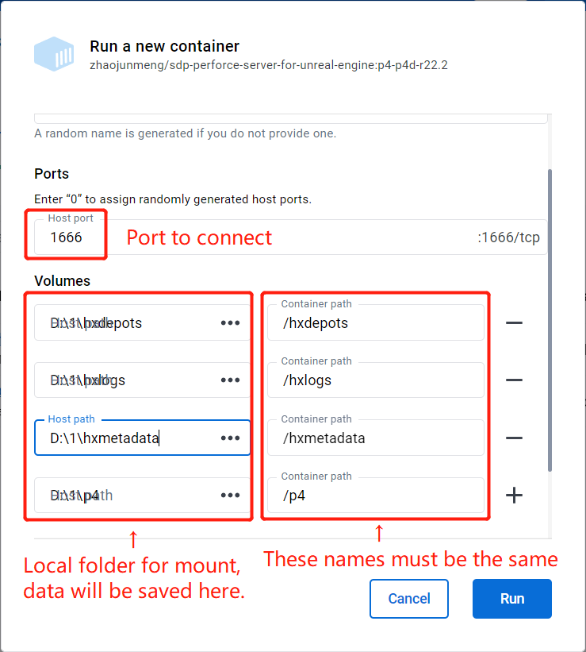
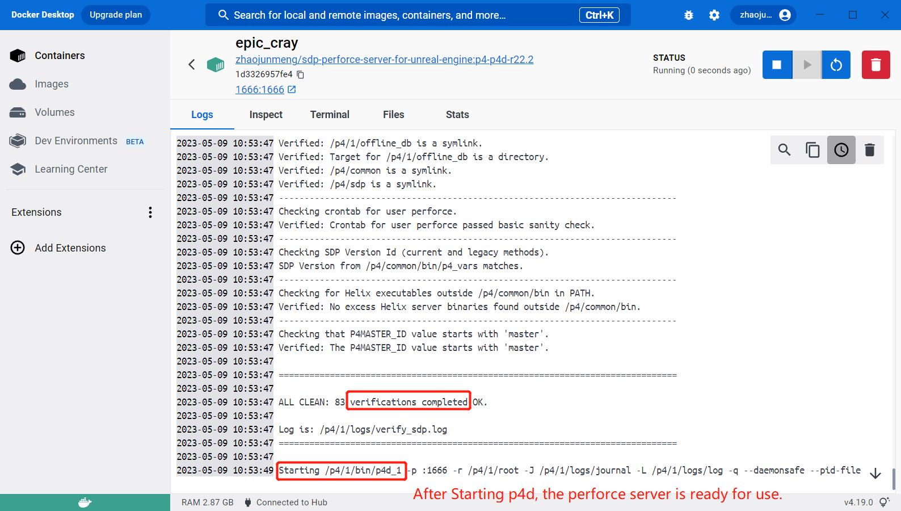

# docker-sdp-perforce-server-for-unreal-engine

Docker perforce server using SDP([Server Deployment Package](https://swarm.workshop.perforce.com/projects/perforce-software-sdp)), configured for Unreal Engine(a unicode, case-insensitive Perforce server with Unreal Engine's recommended Typemap).

## How to use

### 1. Get the Docker image

You can get the Docker image from Docker Hub or build it yourself.

* #### Use prebuilt image

You can use the prebuilt image from Docker Hub: [zhaojunmeng/sdp-perforce-server-for-unreal-engine](https://registry.hub.docker.com/r/zhaojunmeng/sdp-perforce-server-for-unreal-engine/)

* #### Build it yourself

In the project root directory, use the following command to build the image (using p4d version r22.2 as default).

```bash

docker build . -t sdp-perforce-server-for-unreal-engine:r22.2 --no-cache
    
```

If you want to run the container on NAS, you must save the image as a tar file, so you can upload it to the NAS.

```bash
docker save sdp-perforce-server-for-unreal-engine:r22.2 -o sdp-perforce-server-for-unreal-engine-r22.2.tar
```

Available --build-arg:
| ARG         | default value | meaning                                                                |
| ----------- | ------------- | ---------------------------------------------------------------------- |
| OS_DISTRO   | jammy         | ubuntu version                                                         |
| SDP_VERSION | .2022.2.29441 | SDP version                                                            |
| P4_VERSION  | r22.2         | P4 binaries version                                                    |
| P4_BIN_LIST | p4,p4d        | Helix binaries, for minal usage, only p4 and p4d need to be downloaded |

Also you can tweak the .cfg files in the "files_for_run" folder, when you build your own image.

### 2. Run the container

Here's an example running on Docker Desktop.

To run the container from image, the following is required:

Ports: port to connect

Volumes: 4 folders to mount for "/hxmetadata", "/hxdepots", "/hxlogs", "/p4" on the container.(The 4 folders is explained here: [Volume Layout and Hardware](https://swarm.workshop.perforce.com/projects/perforce-software-sdp/view/main/doc/SDP_Guide.Unix.html#_volume_layout_and_hardware))



After clicked "Run" button, see the Docker Logs and wait perforce server(p4d) to start in a few seconds.



### 3. Connect to Perforce server

After the container's first setup, use [P4Admin](https://www.perforce.com/downloads/administration-tool) to login to Perforce to create new depots, groups and users.

>Server: the ip address or domain of your server, for Docker Desktop, it's 127.0.0.1:1666.
>
>User: the default and the only user is "perforce"(configured in p4-protect.cfg), enter the server ip


After click "OK", you must change the default password for user "perforce" (because security level is set to 3).

The old password is F@stSCM! by default (configured in Dockerfile: P4_PASSWD).


After login, you can create new depots, groups and users.

在群晖(NAS)上面如何运行，参考：[如何在群晖(NAS)上，部署一个为UnrealEngine定制的Perforce服务器](docs/HotToRunPerforceServerOnSynologyForUnrealEngine.md)

Enjoy!

## Disclaimer

I decline any responsibility in case of data loss or in case of a difficult (or even impossible) maintenance if you use this solution.  
I did this as a hobby for a small project.  
If you still want to use it for your project, I would suggest to setup or to do regularly backups of your project.
