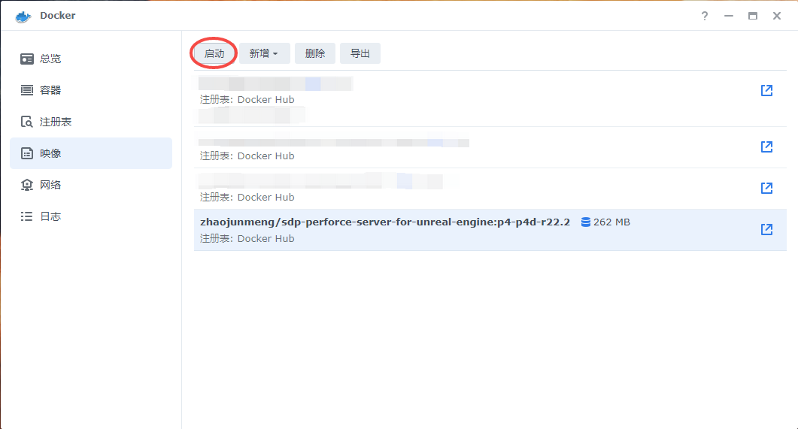
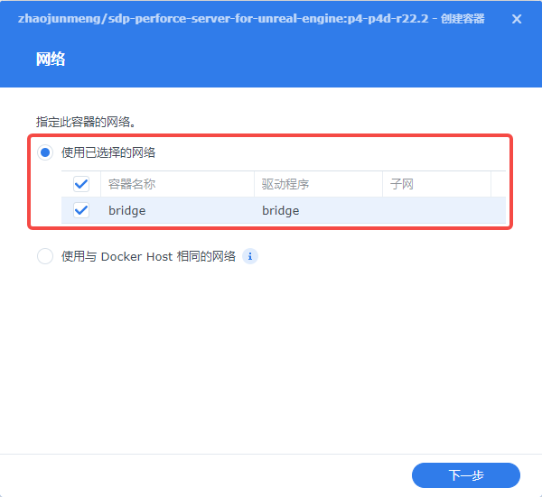
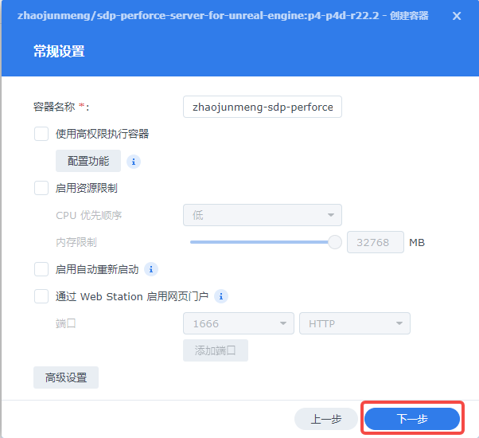
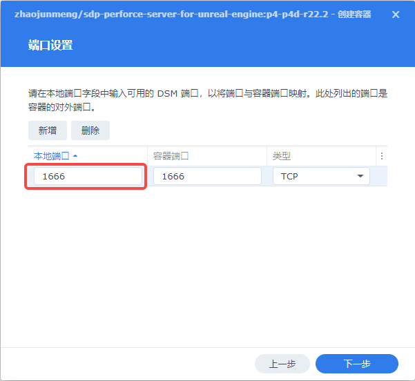
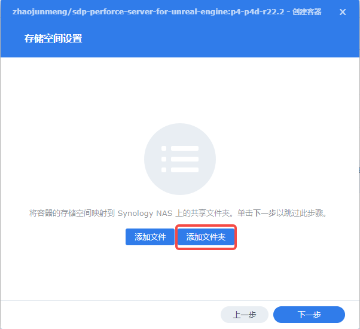
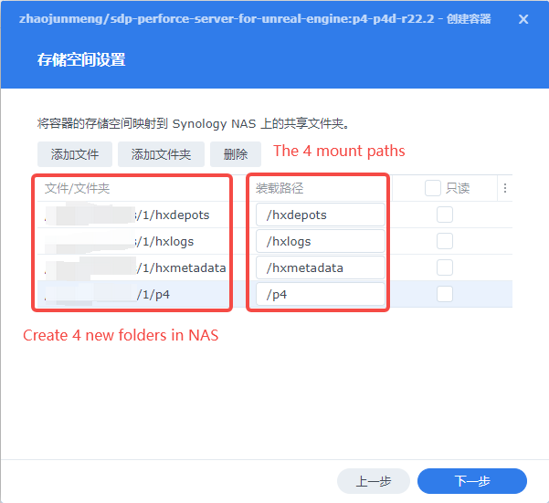
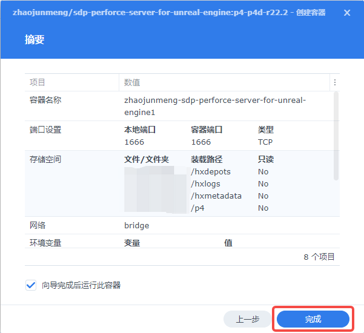
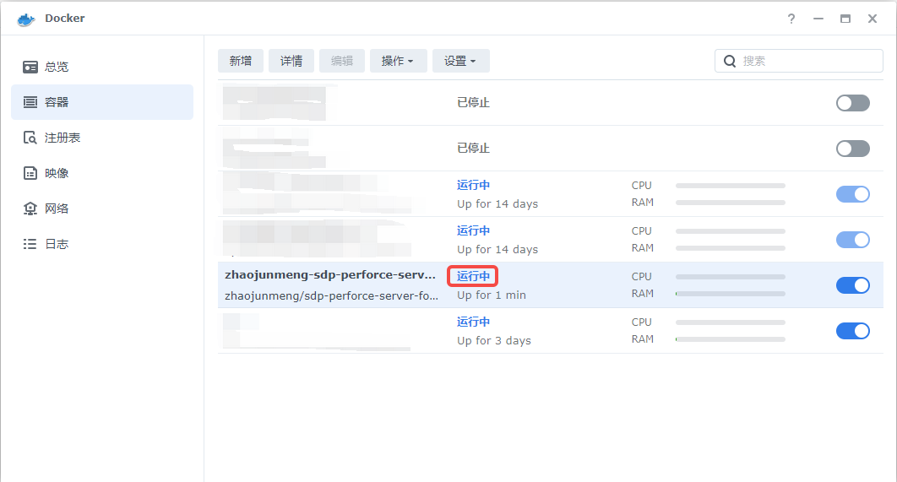
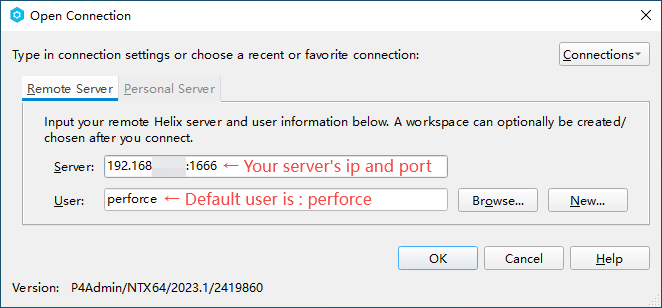
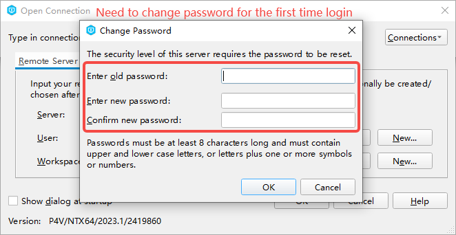

# 如何在群晖(NAS)上，部署一个为UnrealEngine定制的Perforce服务器

## 安装Docker

## 启动容器

## 连接到Perforce服务器

## 如何实现

如何实现参考：[自己动手，在群晖(NAS)上，用Docker搭建Perforce服务器，版本控制Unreal项目](HowToSetupPerforceOnDockerForUnrealEngine.md)